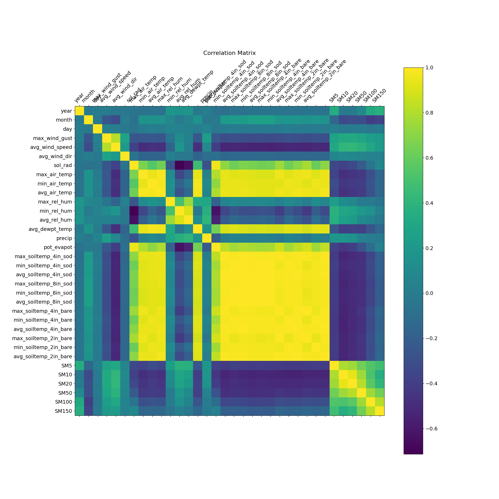
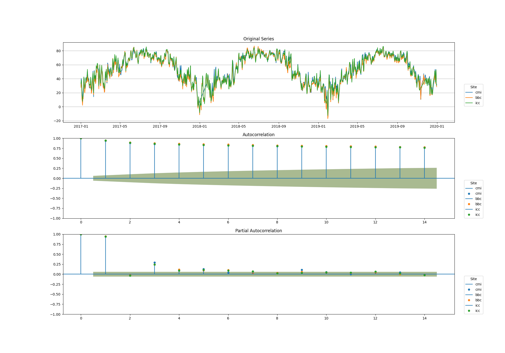

# Illinois Water Survey Soil Forecasting

This repository contains the code for IRC-11 Soil Forcasting.

**Contents**
* [Installation](#installation)
* [Pre-Training Analysis](#Pre-Training-Analysis)
* [Config](#config)

## Installation
### Software Environment
To run this software you will need python 3 installed as well as the python packages contained in requirements.txt

The latest python 3 GUI installer can be downloaded [here](https://www.python.org/downloads/)

Once python is installed you can run ```pip3 install -r requirements.txt``` from a terminal window to install all the required packages.
### Configure the Default Config
Before you are able to run the software you will need to configure the example config and rename it to ```config.ini```. The only required value in the config that needs to be set is the ```data_source```. This is the option that selects what data will be used for analysis.

*Note if you ever lose or need to regenerate the default config you can delete config.ini and example_config.ini and it will make a new one.

## Pre-Training Analysis
The pre-training analysis will be performed on the sample time period specified in the config. It includes the following analysis:

* Csv of the statistics for each site.
  
|       | max_wind_gust | avg_wind_speed |  ...  | SM100 | SM150 |
| :---- | :-----------: | :------------: | :---: | :---: | ----: |
| count |     1053      |      1053      |  ...  | 1053  |  1053 |
| mean  |     16.18     |      4.17      |  ...  | 0.361 | 0.355 |
| std   |     6.12      |      2.33      |  ...  | 0.037 | 0.026 |
| min   |     5.69      |      0.89      |  ...  | 0.250 | 0.273 |
| 25%   |     11.69     |      2.50      |  ...  | 0.360 | 0.345 |
| 50%   |     15.10     |      3.59      |  ...  | 0.370 | 0.360 |
| 75%   |     19.39     |      5.40      |  ...  | 0.379 | 0.379 |
| max   |     42.29     |     17.79      |  ...  | 0.409 | 0.389 |

* Corralation graph of the variables for each site.

* Plot of the orginal data for each variable.
* AutoCorralation Function (ACF) Plot for each variable.
* Partial ACF Plot or each variable.


## Config
**Config Options**
* [Data](#data)
* [Training](#training)
* [Plots](#plots)
* [Other](#other)

### Data
**data_source** : This option is required. It specifies what data file(s) should be used for analysis. You can specify a single file, a list of files, or a directory for it to use.

**prediction_target** : This is the variable in the data that we will be trying to predict.

**validation_percent** : This is the percentage of the data that will be held back from training to be used for validating the model. Right now it just picks the last N percent of the data. Will add better selection methods in the future

**numeric_cols** : These are the variables that will be used as predictors, only variables in this list will be included in the pre-training analysis as well.

### Training
**epochs** : Number of training epochs to do for the neural network based models.

**batch_size** : Number of samples to use at each training step

**early_stopping** : Number of epochs with no improvement in loss required to stop training.

**validation_batchs** : Number of validation batchs to use at each training step

**learning_rate** : The learning rate of the neural network based models.

### Plots
**sample_period_start** : start date of the sample period to use for pre-training analysis. Format is (Month/Day/Year Hour:Min:Sec)

**sample_period_end** : End date of the sample period to use for pre-training alaysis. Format is (Month/Day/Year Hour:Min:Sec)

**acf_days** : Number of days to plot for the ACF/PACF graphs

### Other
**debug_level** : Changes the level of messages included the log log file. Valid options are [DEBUG, INFO, WARNING, ERROR, CRITICAL]

**save_path** : The folder that the results of the run will be saved to. 